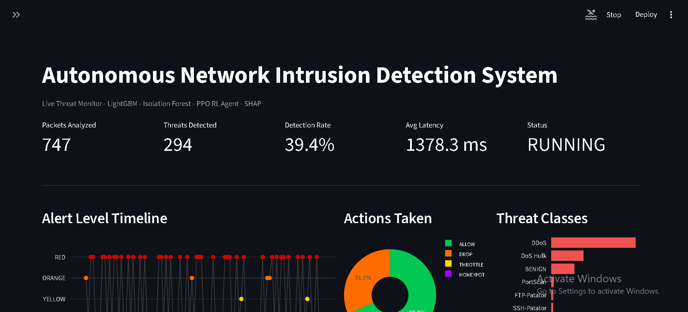
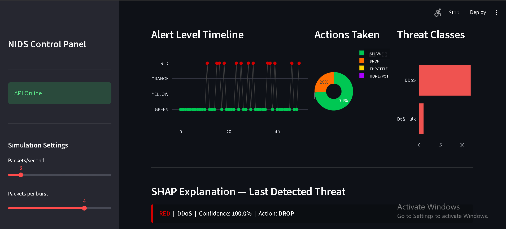
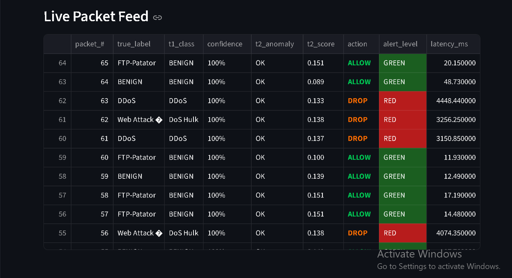
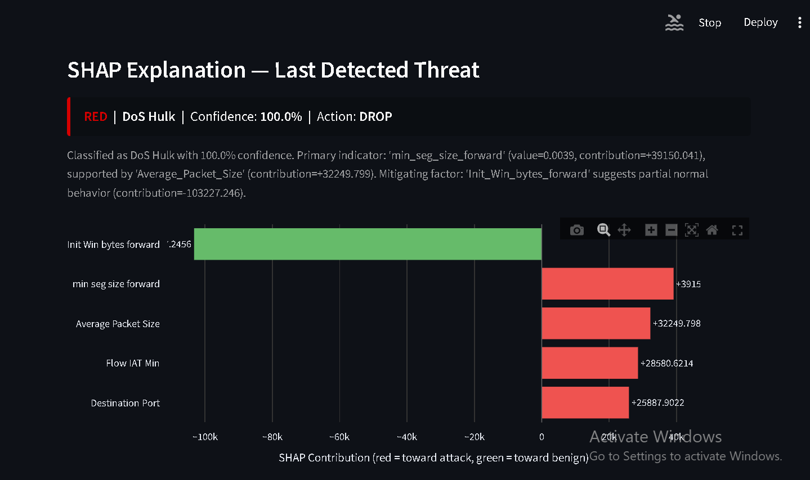
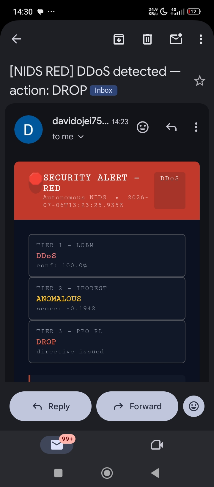
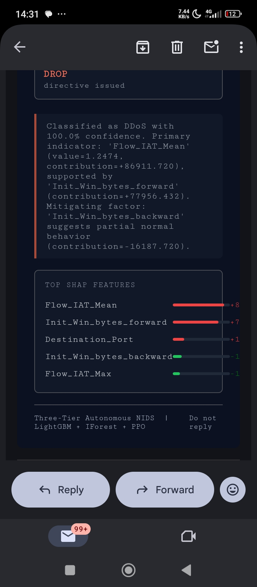

NETWORK INTRUSION SYATEM

Three-tier autonomous cyber defense: 
LightGBM classifier + Isolation Forest anomaly detector + PPO reinforcement learning agent,
with SHAP explainability, real-time email alerts, FastAPI backend, and a live Streamlit
dashboard, all fully containerized with Docker.

DASHBOARD

LIVE PACKET FEED

SHAP EXPLAINER

SECURITY ALERT

TABLE OF CONTENTS
- What This Is
- System Architecture
- How the Three Tiers Work
- Performance Results
- Tech Stack
- Project Structure
- Quick Start
- Running Locally Without Docker
- API Reference
- Training Your Own Models
- Design Decisions
- Known Constraints and Honest Limitations
- The Journey: Bugs, Failures, and What I Learned
- Future Work

What This Is

A production-grade network intrusion detection system that classifies network traffic flows into 15 categories (BENIGN + 14 attack types) using a three-tier autonomous defense pipeline. Built on the CICIDS2017 dataset — 2.26 million real network flow records captured at the Canadian Institute for Cybersecurity — the system processes incoming packets in real time, explains its decisions using SHAP values, and emails the security administrator when it detects a threat.
It is an end-to-end applied ML system with real training pipelines, real debugging histories, and honest performance numbers including where it fails and why.

System Architecture

                    ┌─────────────────────────────────────────────┐
                    │           INCOMING NETWORK PACKET           │
                    │         (78 flow-level features)            │
                    └──────────────────┬──────────────────────────┘
                                       │
                                       ▼
                    ┌─────────────────────────────────────────────┐
                    │          FEATURE SCALER (StandardScaler)    │
                    │  Fitted once on training data, reused       │
                    │  for ALL tiers at inference time            │
                    └──────────────────┬──────────────────────────┘
                                       │
                    ┌──────────────────┼──────────────────┐
                    │                  │                  │
                    ▼                  ▼                  │
     ┌──────────────────────┐  ┌──────────────────────┐   │
     │  TIER 1: LightGBM    │  │  TIER 2: IsoForest   │   │
     │  Multiclass (15)     │  │  Anomaly Detection   │   │
     │  Classifier          │  │  (trained on BENIGN  │   │
     │                      │  │   traffic only)      │   │
     │  PortScan: 95% rec   │  │                      │   │
     │  DDoS:     95% rec   │  │  Catches 53% of      │   │
     │  BENIGN:   96% rec   │  │  T1 misses           │   │
     └──────────┬───────────┘  └──────────┬───────────┘   │
                │                         │               │
                └─────────────┬───────────┘               │
                              │                           │
                              ▼                           │
              ┌───────────────────────────────┐           │
              │  TIER 3: PPO RL AGENT         │           │
              │  (Stable Baselines3)          │◄──────────┘
              │                               │
              │  Observation: 85-dim vector   │
              │  T1 probs × 5 window slots    │
              │   + T2 score + threat rate    │
              │                               │
              │  Actions:                     │
              │    0: ALLOW                   │
              │    1: THROTTLE                │
              │    2: DROP                    │
              │    3: HONEYPOT                │
              │                               │
              │  On attacks: DROP 80%         │
              │  On BENIGN:  ALLOW 99%        │
              └───────────┬───────────────────┘
                          │
                          ▼
          ┌────────────────────────────────────────┐
          │          ALERT LEVEL LOGIC             │
          │                                        │
          │  GREEN  — BENIGN, no anomaly           │
          │  YELLOW — Suspicious but allowed       │
          │  ORANGE — T2 anomaly or attack action  │
          │  RED    — High-confidence attack type  │
          └───────────┬────────────────────────────┘
                      │
          ┌───────────┼───────────┐
          │           │           │
          ▼           ▼           ▼
   ┌────────────┐ ┌────────┐ ┌──────────────────┐
   │ SHAP       │ │ EMAIL  │ │  STREAMLIT       │
   │ Explainer  │ │ ALERT  │ │  DASHBOARD       │
   │ (TreeExpl) │ │ (SMTP) │ │  (Live feed)     │
   └────────────┘ └────────┘ └──────────────────┘

HOW THE THREE TIERS WORK
Tier 1 — LightGBM Multiclass Classifier
LightGBM ingests the 78 scaled flow features and outputs a probability distribution across 15 classes. 
The predicted class is the argmax of this distribution, and the confidence is that class's probability.

Why LightGBM over deep learning:
Network flow data is tabular, not sequential. Gradient boosted trees consistently outperform neural networks on tabular data because they make no assumptions about feature relationships and handle mixed feature scales natively. 
LightGBM specifically uses histogram-based splitting which makes it memory-efficient enough to train on 150k rows in under 2 minutes on a CPU.

Tier 2 — Isolation Forest Anomaly Detector
Trained exclusively on BENIGN traffic, the Isolation Forest learns what "normal" looks like. At inference time, it scores every incoming packet — even ones Tier 1 classifies as BENIGN. A negative decision function score indicates the packet is anomalous relative to the BENIGN baseline, regardless of what the classifier said.
This is the architectural insight that makes the system robust: Tier 1 can be fooled by attacks that look superficially similar to BENIGN traffic, but those same attacks often have statistical anomalies that Isolation Forest catches. In evaluation, Tier 2 caught 53.25% of the attacks that Tier 1 missed.
The detection threshold was found by sweeping percentiles of the training BENIGN score distribution and selecting the threshold that maximised Tier 2's catch rate while keeping false alarms below 5%.

Tier 3 — PPO Reinforcement Learning Agent
The PPO agent makes the final response decision. Its observation is an 85-dimensional sliding window of 5 consecutive packets, where each packet contributes 17 signals: the 15 LightGBM class probabilities, the Isolation Forest anomaly score, and the rolling 100-packet threat rate.
The agent was trained with a reward function that penalises false positives (blocking legitimate traffic) and rewards catching attacks:

ALLOW on BENIGN:   +5.0    ALLOW on ATTACK:  -15.0
THROTTLE on BENIGN: -0.5   THROTTLE on ATTACK: +5.0
DROP on BENIGN:    -2.0    DROP on ATTACK:    +8.0
HONEYPOT on BENIGN:-1.0    HONEYPOT on ATTACK: +6.0

After 500,000 training steps, the agent learned to DROP 80% of real attacks and ALLOW 99.1% of legitimate traffic.

SHAP EXPLAINABILITY
Every flagged packet gets a SHAP explanation using `TreeExplainer` on the LightGBM model. The explanation reports the top 5 features that drove the classification decision,
their raw values, and their SHAP contributions(positive = pushed toward attack, negative = pushed toward BENIGN). This appears in both the dashboard and the alert email

PERFORMANCE RESULTS
Evaluated on a chronologically held-out test set of 37,500 flows (never seen during training).

 Tier 1 — LightGBM Classification

| Class                | Precision | Recall  |   F1  | Support |
| BENIGN               |  98.6%    |  96.2%  | 97.4% | 34,729  |
| DDoS                 | 84.9%     | 94.7%   | 89.6% | 738     |
| PortScan             | 84.5%     | 95.1%   | 89.5% | 1,406   |
| DoS GoldenEye        | 60.8%     | 17.2%   | 26.8% | 507     |
| SSH-Patator          | 0%        | 0%      | 0%    | 101     |
| Bot                  | 0%        | 0%      | 0%    | 19      |
| Overall accuracy     |  94.8%    | 37,500                    |

 System-Level Performance (All Three Tiers Combined)

| Metric                             | Value            |
| System detection rate              | 92.20%           |
| System false alarm rate            | 7.87%            |
| Tier 2 catch rate (of T1 misses)   | 53.25%           |
| Tier 2 false alarm rate on BENIGN  | 4.80%            |
| PPO: DROP rate on real attacks     | 80.5%            |
| PPO: ALLOW rate on real BENIGN     | 99.1%            |
| Average inference latency (Docker) | ~33ms per packet |

 Tech Stack

| Layer            | Technology                   | Why                                             |
| ML — Tier 1      | LightGBM 4.3                 | Best-in-class for tabular data, fast training   |
| ML — Tier 2      | scikit-learn IsolationForest | Unsupervised, no attack labels needed           |
| ML — Tier 3      | Stable Baselines3 PPO        | Battle-tested RL library, gymnasium-compatible  |
| Explainability   | SHAP TreeExplainer           | Exact SHAP values for tree models, fast         |
| API              | FastAPI + Uvicorn            | Async, auto-documented, production-grade        |
| Dashboard        | Streamlit + Plotly           | Rapid ML dashboard development                  |
| Serialization    | joblib                       | Safe, efficient for sklearn/numpy objects       |
| Alerts           | Python smtplib (Gmail)       | Zero extra dependencies                         |
| Containerization | Docker + Docker Compose      | Reproducible, one-command deployment            |
| Dataset          | CICIDS2017                   | 2.26M real network flows, 15 attack types       |

PROJECT STRUCTURE
network-intrusion-system/
├── images/
│  ├── DASHBOARD1.img
│  ├── SHAP.img
│  ├── PACKETFEED.img
│  ├── SECURITYALERT.img
│  ├── SECURITYALERT2.img
│  ├── SHAP2.img
├── app/
│   ├── main.py                       FastAPI application — inference pipeline
│   ├── alerts.py                     Email alert system (AlertManager)
│   ├── shap_explainer.py             SHAP TreeExplainer wrapper
│   ├── preprocess.py                 Data loading, splitting, scaling
│   ├── models.py                     train_lgbm() — LightGBM training wrapper
│   ├── env.py                        FastNetworkDefenseEnv — PPO Gymnasium env
│   └── train.py                      Original Tier 3 PPO training script
├── dashboard/
│   └── streamlit_app.py              Live threat monitoring dashboard
├── artifacts/                        Saved model files (not in git)
│   ├── feature_scaler.pkl            StandardScaler fitted on training data
│   ├── label_encoder.pkl             LabelEncoder for 15 classes
│   ├── tier1_lightgbm.pkl            LightGBM multiclass model
│   ├── tier2_isolation_forest.pkl
│   ├── tier3_ppo_agent_scaled.zip
│   └── system_config.txt             Anomaly threshold, BENIGN index
├── data/
│   └── MachineLearningCVE/           CICIDS2017 CSVs (not in git — too large)
├── retrain.py                        Single-script full pipeline retrain
├── evaluate.py                       Full held-out test set evaluation
├── Dockerfile                        API container
├── Dockerfile.dashboard              Dashboard container
├── docker-compose.yml                Orchestration
├── requirements.txt                  Python dependencies
└── .env                              Email credentials (not in git)

QUICK START
Prerequisites

- Docker Desktop installed and running
- Gmail account with App Password (for email alerts — optional)

1. Clone and configure
bash
git clone https://github.com/JohnBosely/network-intrusion-system.git
cd network-intrusion-system

Create `.env` in the project root:
ALERT_EMAIL_FROM=your@gmail.com
ALERT_EMAIL_PASS=your_16_char_app_password
ALERT_EMAIL_TO=your@gmail.com

To generate a Gmail App Password: myaccount.google.com → Security → 2-Step Verification → App passwords.
If you skip the `.env` file, the system still runs — alerts just log locally instead of emailing.

2. Download the dataset
Download CICIDS2017 from the Canadian Institute for Cybersecurity(https://www.unb.ca/cic/datasets/ids-2017.html) and place the 8 CSV files in `data/MachineLearningCVE/`.
The system will not start without the artifact files. Either train your own (see below) or download pre-trained artifacts.

3. Run
bash
docker compose up

- Dashboard: http://localhost:8501
- API docs: http://localhost:8000/docs
- Health check: http://localhost:8000/health

Click Start in the dashboard sidebar to begin the simulation. 
The system loads attack-heavy CSV slices first so you see real attack traffic immediately.

4. Send your own packet

bash
curl -X POST http://localhost:8000/analyze \
  -H "Content-Type: application/json" \
  -d '{
    "features": {
      "Destination_Port": 22,
      "Flow_Duration": 50000000,
      "Total_Fwd_Packets": 1,
      "SYN_Flag_Count": 1,
      ...
    },
    "include_shap": true
  }'

Running Locally Without Docker

bash
pip install -r requirements.txt
pip install python-dotenv

Terminal 1 — API
uvicorn app.main:app --reload

Terminal 2 — Dashboard
streamlit run dashboard/streamlit_app.py

API Reference
POST /analyze

Runs a single packet through the full three-tier pipeline.

Request body:
json
{
  "features": {
    "Destination_Port": 80,
    "Flow_Duration": 1000000,
    "Total_Fwd_Packets": 100,
    "..."
  },
  "include_shap": true
}

Response:
json
{
  "tier1_predicted_class": "DDoS",
  "tier1_confidence": 0.9472,
  "tier1_top_classes": {"DDoS": 0.9472, "BENIGN": 0.0312, "...": "..."},
  "tier2_anomaly_score": -0.2847,
  "tier2_is_anomalous": true,
  "tier3_action": "DROP",
  "tier3_action_code": 2,
  "shap_verdict": "High packet rate and SYN flood pattern drove DDoS classification",
  "shap_top_features": 
    {"feature": "Flow_Packets/s", "value": 5000.0, "shap_contribution": 0.847, "direction": "toward_attack"},
    "..."
  ,
  "processing_ms": 33.4,
  "system_alert_level": "RED"
}

GET /health
Returns loaded model registry and system status.

GET /alerts?limit=50
Returns the most recent ORANGE/RED alerts fired by the system, with counts by severity.

Training Your Own Models
The entire pipeline — data loading, scaler fitting, LightGBM, Isolation Forest, PPO — runs in a single script:

bash
python retrain.py
Expected runtime: 15-20 minutes on a modern CPU.
The script will abort with a clear error message if the scaler comes out as an identity transform (mean=0, std=1), which was the root cause of the original silent failure mode.

After training, run the full evaluation:
bash
python evaluate.py
This rebuilds the exact same held-out test split used during training and runs all three tiers, reporting per-class precision/recall/F1 and the full alert-level breakdown.

Design Decisions
Why chronological splitting instead of random train/test split?
Network traffic is temporal. A random split would let packets from the same attack session appear in both training and test sets, which makes accuracy look better than it really is. 
The chronological split takes the first 80% of each CSV as training and the last 20% as test, simulating a model trained on past traffic and evaluated on future traffic — the real-world deployment scenario.

Why does the scaler get fitted once and reused for all three tiers?
This was the hardest bug to find. The original codebase had two separate training scripts that each called `scale_features()` independently, producing two different `StandardScaler` objects fitted on different data samples. 
The scaler saved to disk was fitted on one distribution, but the PPO was trained on features scaled by a different distribution that was never saved.
At inference time,`main.py` loaded the saved scaler but LightGBM and PPO had been trained on different scaled representations. Everything looked correct (no crashes, models loaded fine) but every packet was classified as BENIGN with 100% confidence.
The fix: one scaler, fitted once, on the training split used for Tier 1. That same fitted object is passed directly — never refitted — to every subsequent step. `retrain.py` enforces this by aborting with a readable error if the scaler's mean is zero (identity transform).

Why Isolation Forest for Tier 2 and not another classifier?
Two reasons. First, it's unsupervised it only needs BENIGN traffic to train, which means it generalises to attack types it has never seen, including zero-day attacks not in the dataset. A second supervised classifier would only catch attack types it was explicitly trained on. Second, Isolation Forest's decision function produces a continuous anomaly score, not just a binary label, which allows the threshold to be tuned against a false alarm budget rather than being fixed at 0.

Why PPO and not a simpler rule-based system?
The RL agent learns to consider context that rules can't easily capture:
the rolling threat rate (what fraction of recent packets were attacks) and the combined signal from both Tier 1 and Tier 2. A rule like "if attack, then DROP" ignores the confidence of the classification. The PPO agent, after training, learned to DROP when high-confidence attack signals accumulate and ALLOW when signals are ambiguous — a more nuanced policy than any static threshold rule.

Why the sliding window observation for PPO?
A single packet's probability distribution doesn't tell the agent whether it's seeing an isolated anomaly or an ongoing attack. The 5-packet sliding window gives the agent temporal context: it sees the current packet's signals alongside the 4 preceding packets, allowing it to distinguish a burst of attack traffic from a single suspicious flow.

Why class weighting was ultimately removed
Three separate experiments with class weighting (inverse frequency, sqrt smoothing, capped at 5x, capped at 20x) all produced worse results than no weighting.
The fundamental problem: the class imbalance is too extreme. With 115,000 BENIGN rows and 8 Heartbleed rows, any weight that meaningfully amplifies rare classes overwhelms the BENIGN signal. The model then becomes uncertain about BENIGN traffic, which manifests as a catastrophic drop in BENIGN recall (from 96% to 24%) and system-wide false alarm rates above 70%. 
The correct solution for this problem is SMOTE or collecting more data for rare classes — not weighting.

Known Constraints and Honest Limitations

SSH-Patator: 0% recall. SSH brute force traffic is statistically nearly identical to legitimate SSH traffic at the flow level. With only 284 training examples (0.19% of training data), the model has not seen enough of it to learn meaningful boundaries. More training examples would help; the architecture would not need to change.

Bot: 0% recall. 105 training examples — not enough to evaluate meaningfully. The class is included in the model but should not be trusted in deployment.

DoS GoldenEye: 17% Tier 1 recall, 83% Tier 2 catch rate. GoldenEye is a slow-HTTP attack specifically designed to look like legitimate web browsing traffic at the flow level. The low Tier 1 recall is expected and is architecturally correct — this is precisely why Tier 2 exists. The 83% catch rate by the anomaly detector on GoldenEye traffic that Tier 1 missed is the system working as designed.

7.87% system false alarm rate. Slightly above the 5% budget set during Tier 2 threshold tuning. The additional false alarms come from Tier 1 misclassifying some BENIGN traffic as attack types that then trigger the alert logic. In production, this would be calibrated against real network baseline traffic.

Synthetic packets don't look like real traffic. Manually crafted feature vectors (e.g., in the Swagger UI) are consistently misclassified as BENIGN, even when they represent DDoS-like values. The scaler was fitted on 2.26M real captured flows; the inter-feature statistical relationships in hand-crafted packets differ from real traffic in ways the model detects and defaults to BENIGN on. This is expected behaviour, not a bug.

The PPO agent's ALLOW plateau. Approximately 17% of benign packets produce ambiguous LightGBM probability distributions that cause the PPO agent to choose ALLOW even on some attack packets. This is a consequence of LightGBM's uncertainty propagating into the observation vector — when Tier 1 is uncertain, the PPO agent inherits that uncertainty.

The Journey: Bugs, Failures, and What I Learned
This project was built over five weeks. It did not go smoothly at all. Here is an honest account.

Week 1-2: Architecture and First Training
The three-tier architecture was designed upfront and was correct from the start. The first working pipeline produced a LightGBM model with 94%+ accuracy and a basic FastAPI endpoint. The RL agent took 10 separate training iterations before stabilising.

The Scaler Bug (The Critical One)
The system appeared to work perfectly in isolation: the models trained without errors, the API started cleanly, and the Swagger UI returned valid JSON. But every single packet — including textbook DDoS traffic with 5000 SYN packets — came back as BENIGN with 100% confidence.
The root cause took days to find. The `scale_features()` function in `preprocess.py` returned three values `(X_train_scaled, X_test_scaled, scaler)`, but `train.py` called it as `X_train_scaled, _ = scale_features(...)` — silently discarding the scaler. 
A separate patch script then fitted a new scaler on whatever data was available at that moment, which happened to be already-scaled data, producing an identity transform (mean=0, std=1 for every feature — scaling nothing). 
LightGBM trained on raw features. `main.py` scaled incoming packets. The model had never seen scaled data.

The fix: one script (`retrain.py`) that fits the scaler once at Step 2, saves it immediately, and passes the same fitted object to every subsequent step. The script also includes a hard abort if the scaler's mean is zero, so this failure mode is caught in seconds instead of weeks.
What this taught me: The most dangerous bugs are the ones that don't crash. Silent data processing errors that produce plausible-looking output are harder to find than exceptions.

Docker Build Battles
Building the Docker image in my Primary Place of Assignment on a residential internet connection meant dealing with TLS timeouts when pulling packages from PyPI and Docker Hub. Torch alone is 190MB. The solution: split the pip install into separate RUN layers (each layer is cached independently), add `--retries 10 --timeout 300`, and use the CPU-only PyTorch wheel instead of the full GPU version.
The numpy version mismatch between local Python 3.14 (numpy 2.4.2) and the container's Python 3.11 (numpy 1.26.4) caused PPO artifacts to fail to load in the container with `ModuleNotFoundError: No module named 'numpy._core.numeric'`. The PPO checkpoint serialization embeds the numpy version via cloudpickle. Pinning `numpy==2.0.0` in the container (the lowest 2.x version that satisfies all dependencies) and re-saving the PPO artifact with the same numpy resolved this.

The Feature Name Mismatch
When the Docker container started receiving inference requests, every `/analyze` call returned a 500 error. The error message: `Feature names unseen at fit time: ACK_Flag_Count`. The scaler was fitted with space-separated column names (`ACK Flag Count`) because `preprocess.py` reads raw CSVs with space-separated headers. But `main.py` passed underscore-named features to `scaler.transform()` because its `FEATURE_COLUMNS` list uses underscores for Python variable-name compatibility.

The complication: four columns in the CSV already use underscores (`Init_Win_bytes_forward`, `Init_Win_bytes_backward`, `act_data_pkt_fwd`, `min_seg_size_forward`) — so a simple underscore-to-space replacement broke those four. The final fix uses `scaler.feature_names_in_` (the exact column names the scaler saw during fitting) to build the rename mapping, rather than any string transformation.

Six Retraining Runs
| Run | Change                       | System detection | BENIGN recall         | Outcome       |
| 1   | Scaler fixed, no weights     | 94.0%            | 98.8%                 | Best baseline |
| 2   | Weights (20x cap), Broken    | 26.5%            | Reverted              |
| 3   | Weights (5x cap), 98.95%     | 24.7%            | 76% false alarm rate  |
| 4   | No weights, num_leaves=63    | 46.4%            | 84.5% | Overfitting   |
| 5   | num_leaves=63, no weights    | 46.4%            | 84.5% | Same problem  |
| 6   | Original params, no weights  | 92.2%            | 96.2% | Shipped       |  

The 98.95% detection rate in Run 3 is misleading — it came with a 76% false alarm rate on BENIGN traffic, meaning the system was screaming "attack" at three quarters of normal packets.
The lesson: the first good result was the right one. Every subsequent attempt to improve specific numbers made the overall system worse. The fundamental constraint is dataset size — 150,000 training rows is not enough to support both high rare-class recall and low false alarm rates simultaneously.

Future Work
1. Confidence gating before RL escalation. When LightGBM is highly confident a packet is BENIGN (>99% probability), skip the PPO escalation entirely. This would reduce the ~17% of BENIGN packets that produce ambiguous RL decisions and lower the false alarm rate.
2. SMOTE for rare attack classes. Rather than class weighting (which was tried and failed), use Synthetic Minority Oversampling Technique to generate synthetic SSH-Patator and Bot training examples. SMOTE creates synthetic samples by interpolating between existing minority class examples in feature space, which gives the model more boundary examples to learn from without amplifying the influence of the few real examples we have.
3. Meta-learner for adaptive risk scoring. Replace the hand-tuned alert threshold logic with a small logistic regression trained on the outputs of all three tiers. Feed it `t1_confidence, t2_score, t1_predicted_class_idx, action_code` and train it to predict whether the true label was BENIGN or attack. This learns the optimal combination of all three tiers automatically.
4. Real-time packet capture with CICFlowMeter. The current simulation replays CICIDS2017 CSV rows via the dashboard. A true real-time NIDS would run CICFlowMeter as a subprocess to capture live network traffic and compute the 78 flow features from raw packets, then stream those to the `/analyze` endpoint. The architecture already supports this — only the data ingestion layer needs to change.
5. Upgrade the dataset. CICIDS2017 is from 2017. Modern attack patterns (QUIC, TLS 1.3, HTTP/3, cloud-native lateral movement) are not represented. CIC-IDS-2018 and UNSW-NB15 are more recent alternatives.

Dataset
CICIDS2017 — Canadian Institute for Cybersecurity, University of New Brunswick.  
Download: https://www.unb.ca/cic/datasets/ids-2017.html
The dataset contains 2,830,743 network flow records across 8 CSV files, covering Monday through Friday of a simulated enterprise network with both benign traffic and 14 distinct attack types executed by a separate attack machine.

License
MIT License — see LICENSE file.

Built by David Ojei — ML Engineer  
GitHub: github.com/JohnBosely/network-intrusion-system
